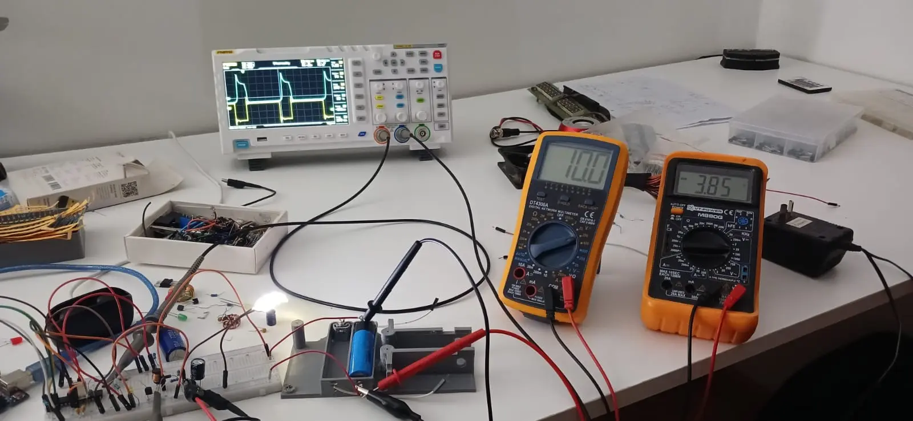

# Convertidor Boost
Diseñé un convertidor del tipo Boost, basandome en la teoría y los componentes que tenía disponibles en el momento

## Objetivo
El objetivo final es tener un convertidor que sea capaz de tomar la tensión de entrada de una celda 18650, y convertirla en la tensión necesaria (aproximadamente 12V) tal que se tenga una luminosidad constante en una tira LED. Estaría bueno tener una lazo de control de corriente y que se pueda variar el brillo.

## Funcionamiento
Un ATMega328P genera una señal PWM con ciclo de trabajo variable (parámetro D del convertidor), tal que varíe la tensión de salida del convertidor.

_En la foto se puede observar como la tensión de la celda (3.85V) se elevaron a 10V_